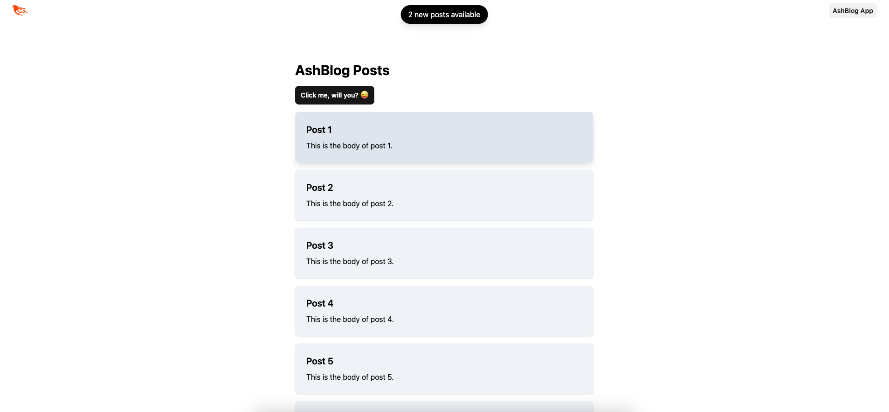
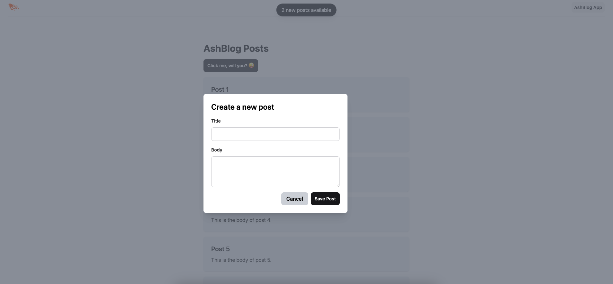

# AshBlog

This is a demo application, used to showcase the use of Ash framework.




To start your Phoenix server:

- Run `mix setup` to install and setup dependencies
- Start Phoenix endpoint with `mix phx.server` or inside IEx with `iex -S mix phx.server`

Now you can visit [`localhost:4000`](http://localhost:4000) from your browser.

## Auto-disappearing flash messages

To enable auto-disappearing flash messages, set the `FLASH_AUTO_DISAPPEAR` environmnet variable to an integer representing the delay in seconds. E.g.

```sh
FLASH_AUTO_DISAPPEAR=3
```

To disable, set to 0. The default is 3 seconds.
